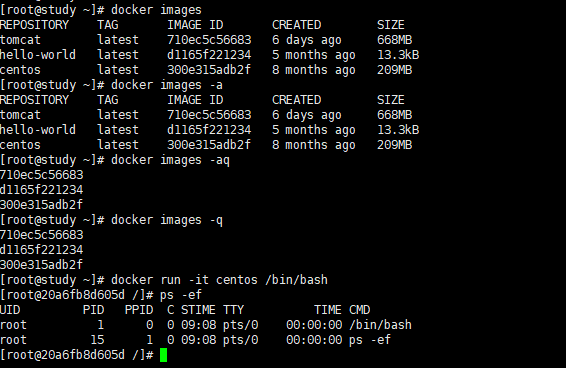

```shell
# 阿里云镜像地址
http://mirrors.aliyun.com/docker-ce/linux/centos/docker-ce.repo
```

## 1.安装

```shell
# 1.安装 yum-utils 包(它提供 yum-config-manager 实用工具)
yum install -y yum-utils
# 官方仓库地址很慢建议更换阿里云镜像地址
# yum-config-manager \
#    --add-repo \
#    https://download.docker.com/linux/centos/docker-ce.repo

# 2.使用推荐阿里云镜像地址 yum-config-manager 实用工具并设置稳定存储库。
sudo yum-config-manager \
    --add-repo \
    http://mirrors.aliyun.com/docker-ce/linux/centos/docker-ce.repo
# 3.建议更新Yum软件包索引
yum makecache fast
# 4.安装docker docker-ce 社区版 ee企业版
yum install docker-ce docker-ce-cli containerd.io
# tip: 如果提示接受 GPG 密钥，验证指纹是否与060A 61c51b558a7f 742B 77AA C52F EB6B 621E 9F35匹配，如果是，接受它。
```

## 2.Docker启动和卸载

```shell
# 启动docker
systemctl start docker
# 通过运行 hello-world 映像来验证 Docker Engine 安装是否正确
docker run hello-world
# 卸载docker
yum remove docker \
                  docker-client \
                  docker-client-latest \
                  docker-common \
                  docker-latest \
                  docker-latest-logrotate \
                  docker-logrotate \
                  docker-engine
```

## 3.Docker常用命令

### 帮助命令

```shell
# 获取版本号
docker Version
# 获取详细信息
docker info
# 获取帮助
docker --help
```

### 镜像命令

#### docker images

```shell
# 列出本机上的镜像
docker images

# OPTIONS 说明
-a :列出本地所有的镜像（含中间映像层，默认情况下，过滤掉中间映像层）；
--digests :显示镜像的摘要信息；
-f :显示满足条件的镜像；
--format :指定返回值的模板文件；
--no-trunc :显示完整的镜像信息；
-q :只显示镜像ID。
```


> 以hello-world为例 各个选项说明

```shell
#镜像的仓库源   #镜像标签   #镜像id         #镜像创建时间    #镜像大小
REPOSITORY    TAG       IMAGE ID       CREATED        SIZE
hello-world   latest    d1165f221234   5 months ago   13.3kB
同一个仓库源可以有多个tag，代表这个仓库源的不同个版本
使用REPOSITORY:TAG来定义不同的镜像
如果不指定一个镜像的版本标签，例如你只使用centos，docker将默认使用centos:latest镜像
```

#### **docker search**

```shell
#网站 www.dockerhub.com
docker search [OPTIONS] 镜像名字
```

* OPTIONS 说明

```shell
-f, --filter filter <过滤条件>:列出收藏数不小于指定值的镜像。  >=filter
--limit int 搜索结果显示的最大数量(default 25)范围[1-100]
```

```shell
# docker search -f starts=10 java
```


```shell
# docker search --limit 50 java
```


#### **docker pull**

```shell
# 拉取镜像
docker pull [OPTIONS] NAME[:TAG]
```

* OPTIONS说明:
```shell
-a:拉取所有 tagged 镜像
--disable-content-trust:忽略镜像的校验,默认开启
```

```shell
# docker pull centos
```


#### docker rmi

```shell
# docker rmi 某个XXX镜像的名字ID
docker rmi [OPTIONS] IMAGE [IMAGE...]
```

* OPTIONS说明:

```shell
 -f, --force  强制删除图像
 --no-prune   不删除未标记的父项
```

```shell
#删除单个
docker rmi -f 镜像ID
#删除多个 
docker rmi -f 镜像名1:TAG 镜像名2:TAG
#删除多个 
docker rmi -f ${docker images -qa}
```

#### docker 新建并启动容器

```shell
# docker run 新建并启动容器
docker run [OPTIONS] IMAGE [COMMAND]
```

* OPTIONS 说明 

```shell
# OPTIONS说明(常用) :有些是一个减号，有些是两个减号
--name="容器新名字":为容器指定一个名称;
-d:后台运行容器，并返回容器ID， 也即启动守护式容器;
-i:以交互模式运行容器，通常与-t同时使用;
-t:为容器重新分配一个伪输入终端，通常与-i同时使用;
-P:随机端口映射;
-p:指定端口映射，有以下四种格式
ip:hostPort:containerPort
ip::containerPort
hostPort:containerPort
containerPort
```



```shell
# docker run -it centos /bin/bash
使用镜像centos：latest以交互模式启动一个容器，在容器内执行/bin/bash命令
```

#### docker 退出容器

```shell
# 两种退出方式
exit 容器停止退出
ctrl+P+Q 容器不停止退出
```

#### 启动容器

```
docker start 容器ID或容器签名
```

#### 重启容器

```
docker restart 容器ID或容器签名
```

#### 停止容器

```
docker stop 容器ID或容器签名
```

#### 强制停止容器

```
docker kill 容器ID或容器签名
```


#### 删除已停止的容器

```shell
# 删除已停止的容器
docker rm 容器ID  -f
# 一次性删除多个容器
docker rm -f $(docker ps -a -q)
docker ps -a -q | xargs docker rm

# OPTIONS:说明
-f :通过 SIGKILL 信号强制删除一个运行中的容器。
-l :移除容器间的网络连接，而非容器本身。
-v :删除与容器关联的卷。

```


#### docker ps

```
docker ps [OPTIONS]
```

* OPTIONS说明(常用) :

```shell
-a :列出当前所有正在运行的容器+历史上运行过的
-|:显示最近创建的容器。
-n:显示最近n个创建的容器。
-q :静默模式，只显示容器编号。
--no-trunc :不截断输出。
```


### 重要

#### 启动守护式容器

```shell
#使用镜像centos:latest以后台模式启动一个容器
docker run -d centos
```

> **问题**:然后`docker ps -a`进行查看,**会发现容器已经退出**


> 很重要的要说明的一点: **Docker容器后台运行,就必须有一个前台进程.**
> 容器运行的命令如果不是那些**一直挂起的命令** (比如运行top，tail) ，就是会自动退出的。
> 这个是**docker**的机制问题,比如你的web容器，我们以**nginx**为例，正常情况下,我们配置启动服务只需要启动响应的**service**即可。例如`service nginx start`
> 但是,这样做,**nginx**为后台进程模式运行,就导致**docker**前台没有运行的应用,这样的容器后台启动后，会立即自杀因为他觉得他没事可做了.所以，最佳的解决方案是将你要运行的程序**以前台进程的形式运行**。

#### 查看容器日志

```shell
#查看容器日志
docker logs -f -t --tail 容器ID 

# Options说明：
-f : 跟踪日志输出
--since :显示某个开始时间的所有日志
-t : 显示时间戳
--tail :仅列出最新N条容器日志
```
```shell
#官方help
Options:
      --details        详细信息显示提供给日志的额外详细信息
  -f, --follow         跟踪日志输出
      --since string   显示自时间戳（例如2013-01-02T13:23:37Z）或相对时间戳（例如42分钟的42m）以来的日志
  -n, --tail string    从日志末尾显示的尾字符串行数（默认为“全部”）
  -t, --timestamps     显示时间戳
      --until string   显示时间戳（例如2013-01-02T13:23:37Z）或相对时间戳（例如42分钟的42m）之前的日志
```

```shell
# 跟踪查看容器mynginx的日志输出。
docker logs -f 容器ID
# 查看容器mynginx从2016年7月1日后的最新10条日志。
docker logs --since="2016-07-01" --tail=10 容器ID
```

#### 查看容器内的进程

```shell 
docker top 容器ID
```

#### 查看容器内部细节

```shell
docker inspect 容器ID
```


#### 进入正在运行的容器并以命令行交互

```shell
#重新进入docker 
docker attach 容器ID
docker exec -it 容器ID bashShell

```


```shell
#上述两个区别
attach 直接进入容器启动命令的终端，不会启动新的进程
exec 是在容器中打开新的终端，并且可以启动的一个个新的进程
```

#### 从容器内拷贝文件到主机上

docker cp 容器ID:容器内路径 目的主机路径


小结


### 4.Docker镜像commit操作

```shell
#Docker镜像commit操作
docker commit 提交容器副本使之称为一个新的镜像
docker commit -m="提交的描述信息" -a="作者" 容器ID 要创建的目标镜像名:[标签名]

docker run -d -p 8080:8080 tomcat

OPTIONS说明：
-p主机端口：docker容器端口
-P:随机分配端口
i:交互
t:终端
```

> 从docker拉取的tomcat访问404，解决tomcat 访问404的文通并进行提交镜像
>
> * `docker run -d -p 8888:8080 tomcat`
> * `docker ps -a`
> * `docker exec -it 镜像id  /bin/bash`
> * `ls -l`
> * `rm -rf webapps`
> * `cp -rf webapps.dist/ webapps`
> * `docker commit -m="描述" -a="author作者" 镜像id backbay2/tomcatdemo(指定要创建的目标镜像名)  `


> 启动镜像
>
> * `docker images -a`
> * `docker run -d -P backbay2/tomcat_modify`
> * `docker ps -a`


>  curl -I  http://localhost:49153


> 删除doc 重新commit新的镜像
>
> * docker ps -a
> * docker run -d -P backbay2/tomcat_modify
> * docker ps -a
> * docker exec -it 镜像id /bin/bash
> * ls -l
> * cd webapps
> * ls -l
> * rm -rf docs
> * cd docs
> * exit
> * docker commit -m="no docs 的镜像" -a="backbay2" 镜像id backbay2/tomcat_no_docs:v1.0.0


